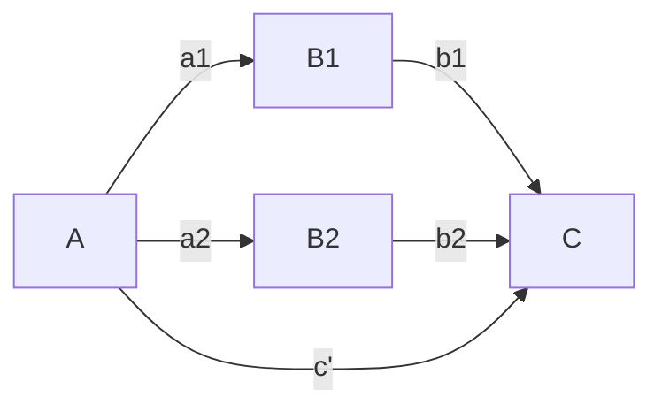

# Direct effect matrix examples
Permanent Note
Created: 01-07-2022 16:43

## Parallel effects
| |A|B1|B2|C|
|---|---|---|---|---|
|A|0|0|0|0|
|B1|1|0|0|0|
|B2|1|1|0|0|
|C|1|1|1|0|

The direct effects matrix can also be created using values other than one. If a value of two is entered, than this indicates that a quadratic is to be used. This can also include third order (cubic) relationships. 
When creating the polynomial relationships it is necessary that the variables be mean centered before multiplied. 
There also needs to be a check on the outcome variable to determine if it is categorical or not. If so, than [[Logistic regression with multiple predictors|logistic regression ]] needs to be used. 

## References
1. 