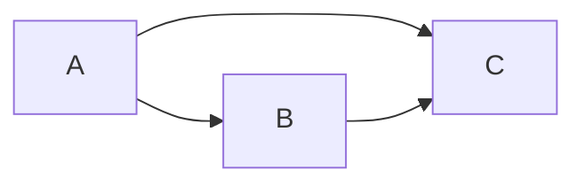

# Model 4


## Its definition file
[[Model4_definition]]


## Setting up the models for analysis
[[Prepare Model for Analysis]]

```python
	Out = ['', 'B', 'C']
	In = [[],['A'],['A','B']]
	Inter = [ [[]], [[]], [[]] ] 
```

## Estimating the regression equations
[[Run Regression Model]]

```python
	regstats(B,[A])
	regstats(C,[A B])
```		
