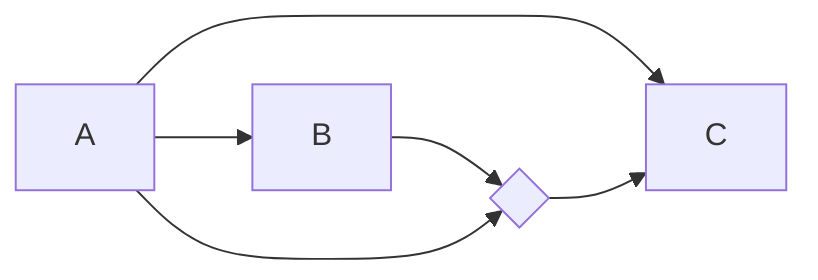

# Model 5


## Its definition file
[[Model5_definition]]

## Setting up the models for analysis
[[Prepare Model for Analysis]]

```python
	Out = ['', 'B', 'C']
	In = [[],['A'],['A','B']]
	Inter = [ [[]], [[]], [['A','B']] ] 
```

## Estimating the regression equations
[[Run Regression Model]]

```python
	regstats(B,[A])
	regstats(C,[A B dA*dB])
```
