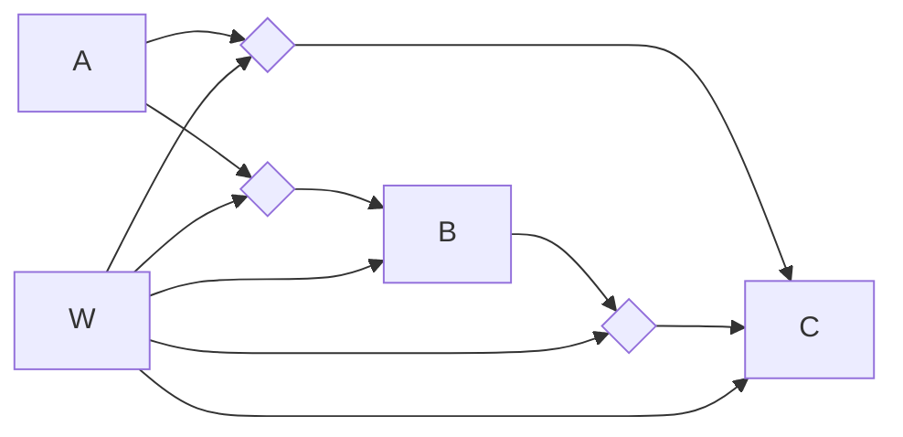

# Model 6


## Its definition file
[[Model6_definition]]

## Setting up the models for analysis
[[Prepare Model for Analysis]]

```python
	Out = ['',B', 'C','']
	In = [[],['A','W'],['A','B','W'],[]]
	Inter = [ [[]], [['A','W']], [['B','W'], ['A','W']], [[]] ]
```

## Estimating the regression equations
[[Run Regression Model]]

These are the regression equations that should be created from this process. dA means variable A with its mean removed

```python
	regstats(B,[A W dA*dW])
	regstats(C,[A B W dB*dW dB*dW])
```		
