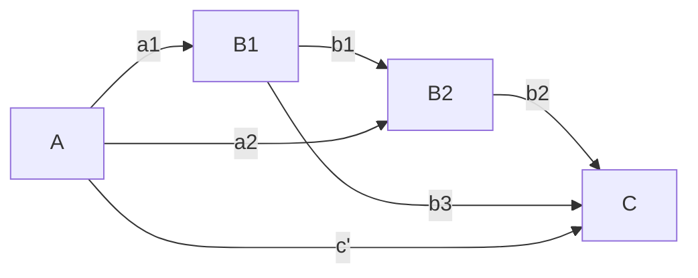

# Serial Mediation
Permanent Note
Created: 01-07-2022 11:01
#statistics

$B1 = \beta_0 + a_1 \cdot A + e_i$
$B2 = \beta_0 + a_2 \cdot A + b_1 \cdot B1 + e_i$
$C=\beta_0 + c' \cdot A + b_3 \cdot B1 + b_2 \cdot B2 + e_i$
## Pathways
$a_1 \cdot b_1 \cdot b_2$
$a_2 \cdot b_2$
$a_1 \cdot b_3$

---
## References
1. https://www.frontiersin.org/articles/10.3389/fnagi.2016.00162/full
2. Steffener J, Gazes Y, Habeck C, Stern Y. The Indirect Effect of Age Group on Switch Costs via Gray Matter Volume and Task-Related Brain Activity. _Front Aging Neurosci_. 2016;8:162.
3. 