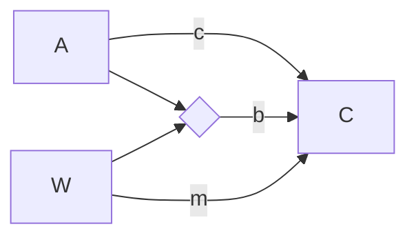

# Simple Moderation
Permanent Note
Created: 01-07-2022 11:14
#statistics

This model focuses on the effect of A on C. This relationship is moderated by the variable W. In this figure the diamond reflects an interaction between the two variables.

$C = \beta_0 + c\cdot A + m\cdot W + b\cdot A\cdot W$
This is the regression equation for this model. Which can be rewriteen as:
$C = \beta_0 + m\cdot W + (c + b\cdot W)\cdot A$
When written like this you can see how the A variable is now a linear function of the moderating variable. 

To interpret this model first determine if parameter $b$ is significant. Then the model can be [[Probing an Interaction|probed]] to identify the range of values of W for which the A effect is significant. 

## References
1. 