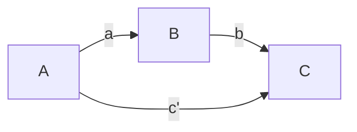

# The direct effects matrix
Permanent Note
Created: 01-07-2022 16:42

Define a matrix of ones and zeros for defining the relationships between variables and the models to test.

The model definition matrix is square with one row and one column for each variable:

| |A|B|C|
|---|---|---|---|
|A|0|0|0|
|B|1|0|0|
|C|1|1|0|

This matrix is read row by row with the variable in each row being the outcome variable. Each column with a value in it is a predictor in the model. In the above figure, there are two equations. The two equations are:
 
$B = \beta_0 + \beta_1 \cdot A + e_i$
 
$C = \beta_0 + \beta_1 \cdot A + \beta_2 \cdot B + e_i$
 

It is also possible that an analysis requires the same outcome variable in multiple equations. Even in the simplest model this is the case. Therefore, there needs to be a second layer (third dimension) to the above matrix. It will be like this:

| |A|B|C|
|---|---|---|---|
|A|0|0|0|
|B|0|0|0|
|C|1|0|0|

$C = \beta_0 + \beta_1 \cdot A + e_i$

Therefore, any program that reads such a matrix will cycle over the third dimension and then the rows.

## References
1. [[Direct effect matrix examples]]