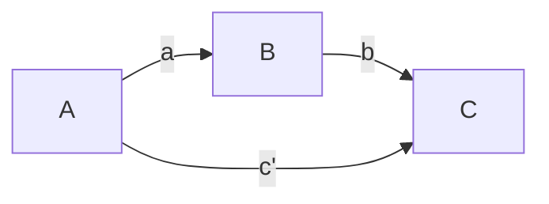

# The Path Matrix
Permanent Note
Created: 01-07-2022 16:45

Once [[The direct effects matrix]] is defined, the paths through the model are needed. These are used to calculcate the indirect effects. The path matrix is identical in its set up as the direct effects matrix; however, now the values reflect the steps in the paths. For instance, in the following matrix the steps are the effect of A on B and then the effect of B on C. There can be multiple paths, in more complicated models, and this matrix can have multiple layers. For each defined path, one per layer, the result becomes a value that needs to be [[Bootstrap Resampling|bootstrapped.]]

| |A|B|C|
|---|---|---|---|
|A|0|0|0|
|B|1|0|0|
|C|0|2|0|

The calculated path in this example is:
(A-->B) times (B-->C)

1. 