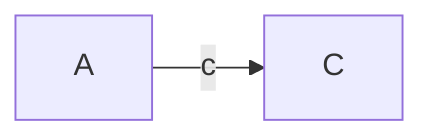
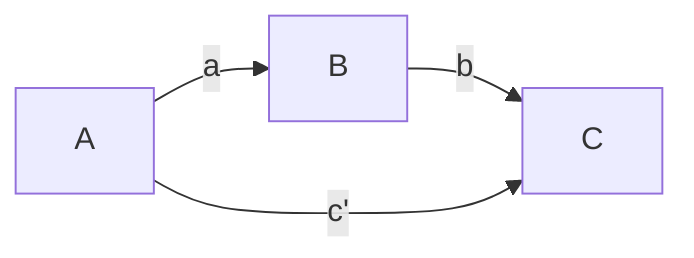

# Three Variable Mediation Model
Permanent Note
Created: 01-07-2022 10:13
#statistics 

The three variable model consists of testing three linear regression models. First, is the simple one where only the effect of the independent variable is regressed onto the dependent (outcome) variable. The parameter estimate $c$ is also called the **total** effect. 

$C = \beta_0 +c\cdot A$

Next the following two regression equations are fit. There is the model to assess the size of the effect of the indepdent variable on the mediator, A --> B, and then the effect of independent variable on the dependent variable, after accounting for the effect of the mediator variable. 

$B=\beta_0+a\cdot A$
$C = \beta_0+c'\cdot A+b\cdot B$

Once these regression models are fit to the data the following effects are reported:
1. a
2. b
3. c' : this is called the direct effect
4. c: this is called the total effect
5. $a\cdot b$: this is called the indirect effect

Effects 1 through 4 can be evaluated with standard statistics (t-tests). The indirect effect needs to be evaluated with [[Bootstrap Resampling]] and [[Bias-corrected Confidence Intervals]].

## Caution
[[Caution for Mediation Analyses when there is moderation]]
## References
1. 